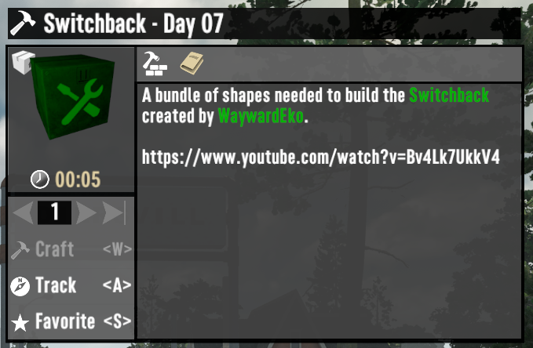
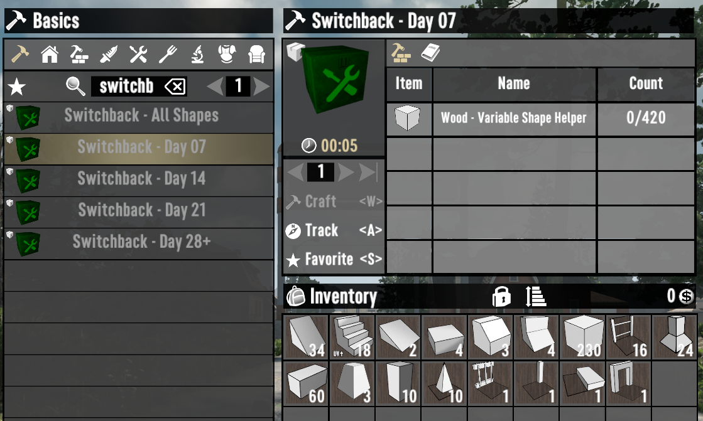
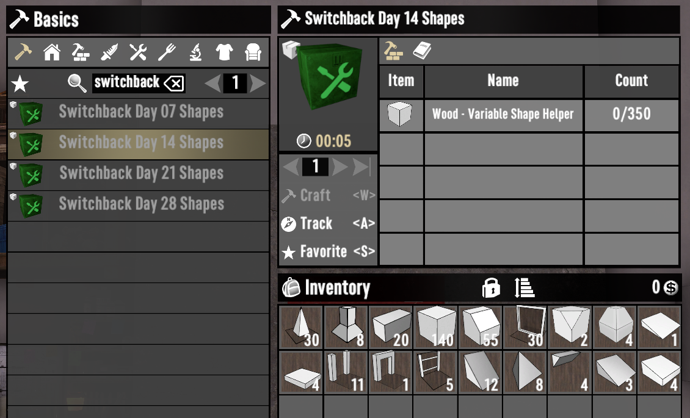
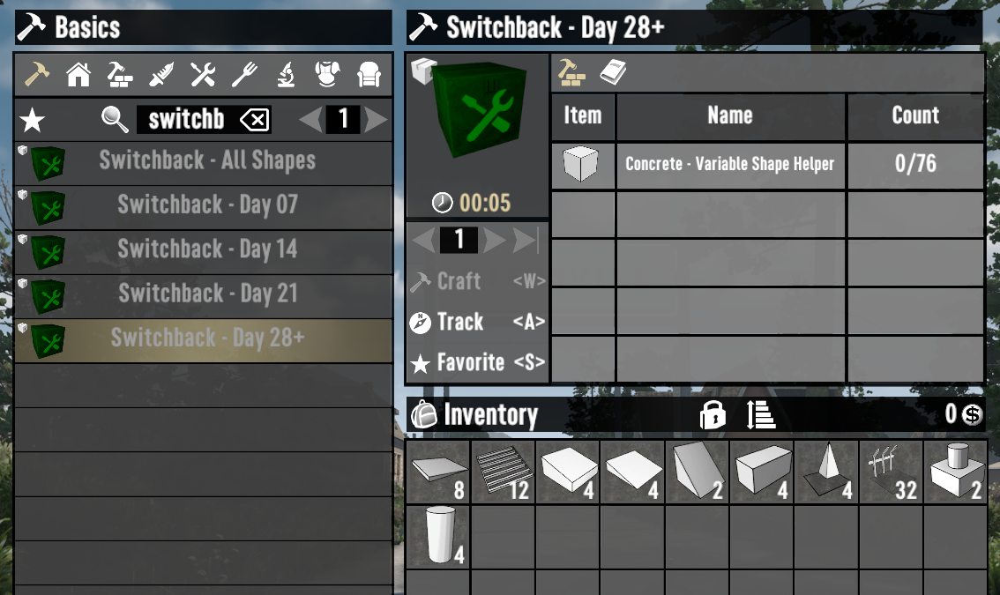
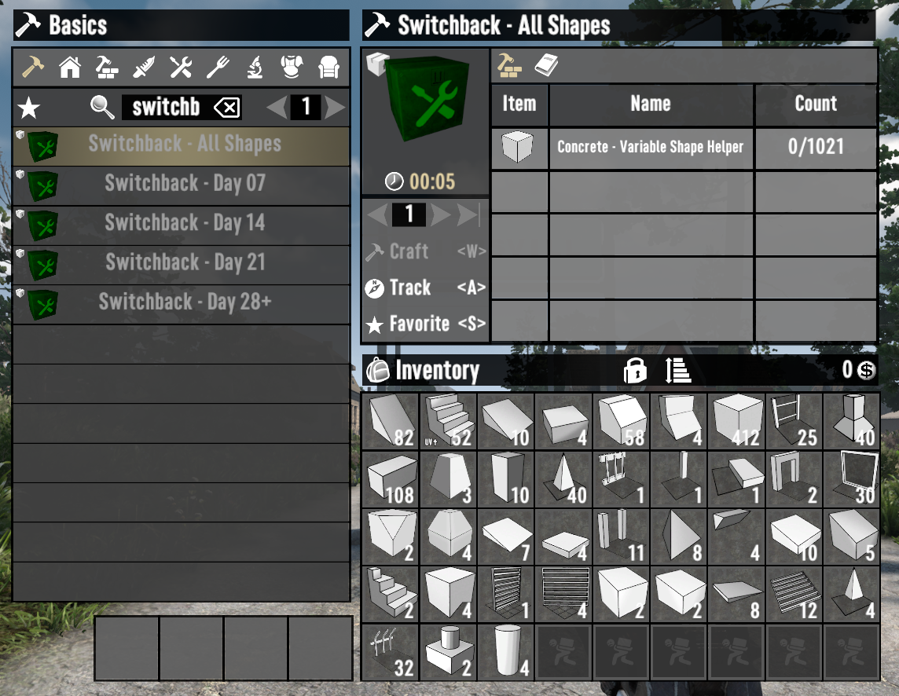

# ISI Build Bundles

A 7 Days to Die (7D2D) mod that adds shape bundles for building horde bases.

## Included Bases

- [WaywardEko's Switchback](https://www.youtube.com/watch?v=Bv4Lk7UkkV4)

## Example

