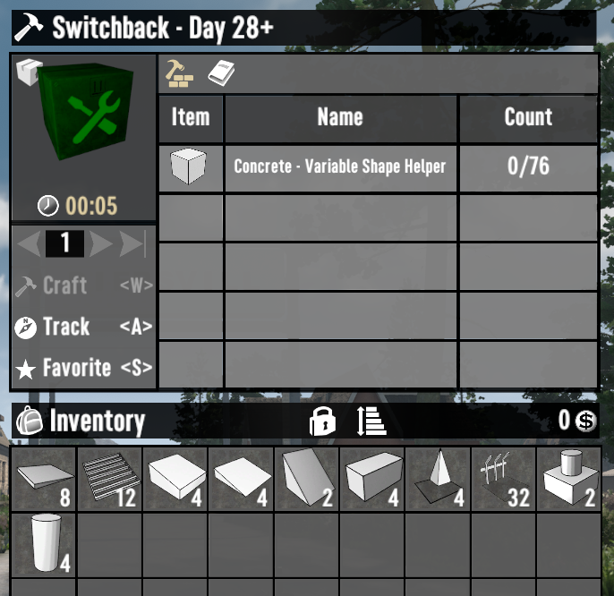

# ISI Build Bundles

A 7 Days to Die (7D2D) mod that bundles the shapes needed to build specific horde bases.

## Included Bases

- [WaywardEko - Switchback](https://www.youtube.com/watch?v=Bv4Lk7UkkV4)
- [WaywardEko - Seeker's Bane](https://www.youtube.com/watch?v=jEMnP7sHEzo)

## Example

