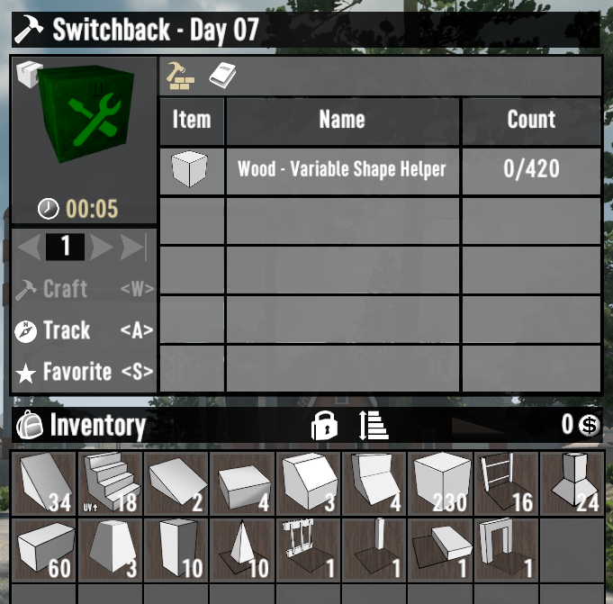
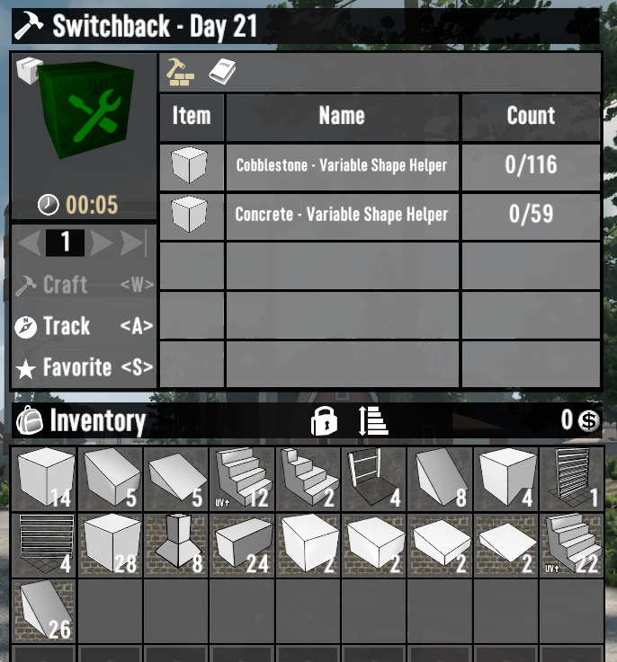

# ISI Build Bundles

A 7 Days to Die (7D2D) mod that simplifies the building process by providing convenient recipes to convert building blocks into the specific shapes needed for iconic horde bases.

## Included Bases

- [WaywardEko - The Eko Box](https://www.youtube.com/watch?v=mvx9sxO_FZQ)

- [WaywardEko - Eko Craft](https://www.youtube.com/watch?v=szxHF5YGD44)
- [WaywardEko - Spiral Sentry](https://www.youtube.com/watch?v=Evp-3gU4P24)

- [WaywardEko - Switchback](https://www.youtube.com/watch?v=Bv4Lk7UkkV4)
- [WaywardEko - Seeker's Bane](https://www.youtube.com/watch?v=jEMnP7sHEzo)
- [WaywardEko - The Spark](https://www.youtube.com/watch?v=GcciKSy9z_M)
- [WaywardEko - The Foundry: Horde Base](https://www.youtube.com/watch?v=k89FE_6P9fA)
- [WaywardEko - The Foundry: Crafting Base](https://www.youtube.com/watch?v=UT6BViqGJkg)
- [WaywardEko - The Eko Mini](https://www.youtube.com/watch?v=Xd5JG4OIoyI)

## Screenshots

## Testing

- Craft "Switchback - All Shapes" and "Switchback - Day 07" bundles
- Open the bundles
- Confirm bundle names are user friendly
- Confirm bundle descriptions are user friendly
- Confirm builds have alternating light and dark green tints
