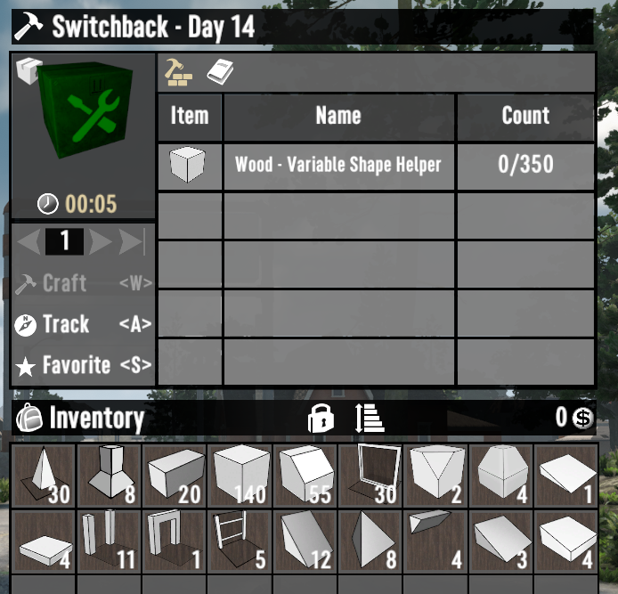
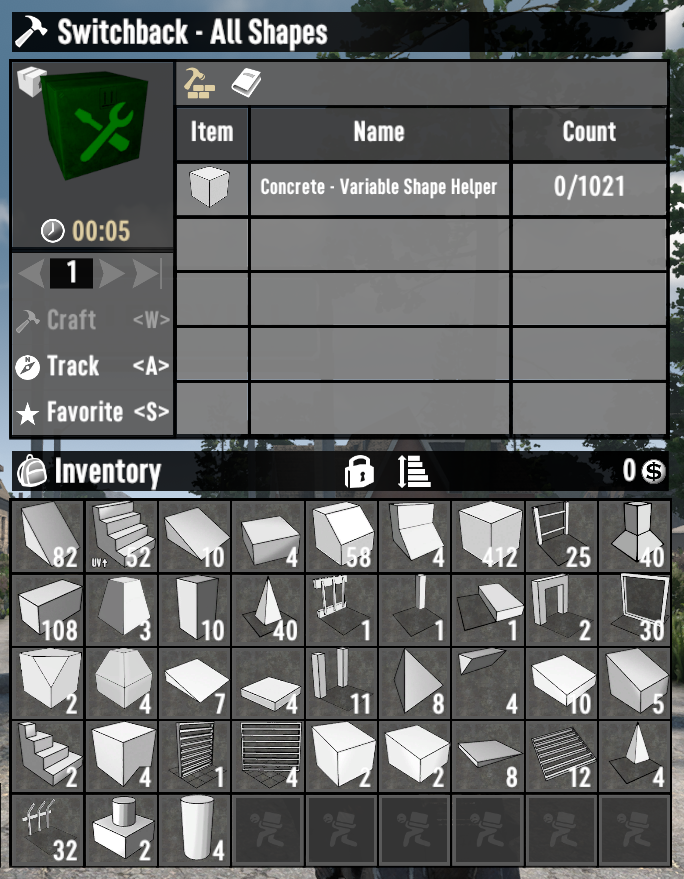

# ISI Build Bundles

A 7 Days to Die (7D2D) mod that bundles the shapes needed to build specific horde bases.

## Included Bases

- [WaywardEko - The Eko Box](https://www.youtube.com/watch?v=mvx9sxO_FZQ)

- [WaywardEko - Eko Craft](https://www.youtube.com/watch?v=szxHF5YGD44)
- [WaywardEko - Spiral Sentry](https://www.youtube.com/watch?v=Evp-3gU4P24)

- [WaywardEko - Switchback](https://www.youtube.com/watch?v=Bv4Lk7UkkV4)
- [WaywardEko - Seeker's Bane](https://www.youtube.com/watch?v=jEMnP7sHEzo)
- [WaywardEko - The Spark](https://www.youtube.com/watch?v=GcciKSy9z_M)
- [WaywardEko - The Foundry: Horde Base](https://www.youtube.com/watch?v=k89FE_6P9fA)
- [WaywardEko - The Foundry: Crafting Base](https://www.youtube.com/watch?v=UT6BViqGJkg)

## Example

## TODO

- Verify Counts (Build The Base)

- Publish

- Stage Bundles?

- Localization
  - Shorten, so it does not squish excessively
  - Figure out a Max Width
